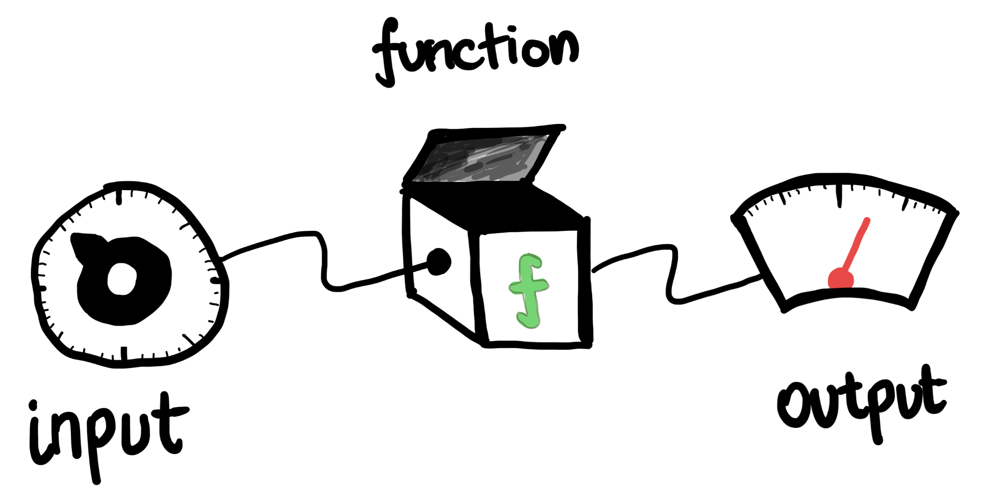
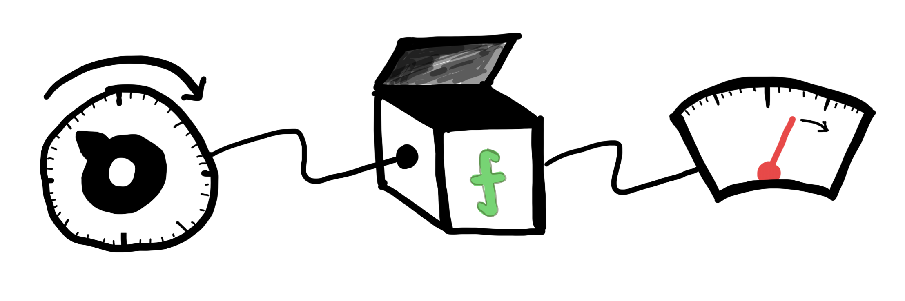
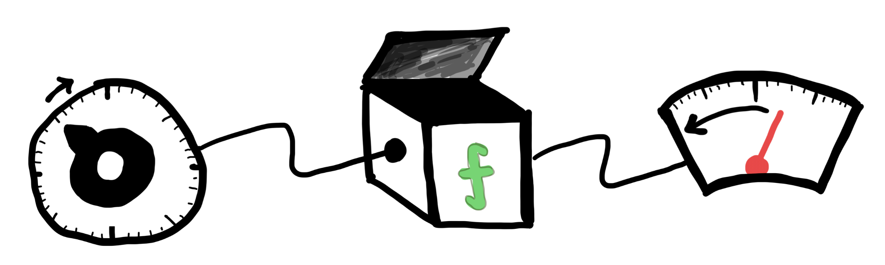

---
format:
  html:
    page-layout: full
---

# 1. Understanding the Derivative

::: {.panel-tabset .nav-pills}

## Intro

#### What is a mathematical function?

The word "function" has many uses in colloquial English. In day-to-day use, it might mean the purpose or individual role of an object; in computer science, it refers to a reusable block of code that performs a specific action. The word "function" when used in math class might bring to mind sines, cosines, logarithms or polynomials. We might also think of graphs of functions, x and y axes, and various formulas we have learned to write down. But how exactly do we define a mathematical function?

It turns out that the formal definition is very broad-- a mathematical function is just a box that takes some possible inputs, and for each input it spits out an output. Any black box will do, as long as giving the same input many times will always result in the same output (in other words, no "randomness"). For example, we could have a function that takes in English words as input and returns their first letter as output ("apple" --> "a"), or a function that takes a location on the surface of the Earth as input and returns as output the mean surface temperature at that location on May 15, 1985.
  

::: {#fig-func-def}
{width="50%"}

A black box.
:::

  
Formulas like $\sin(x)$, $e^x$ and $x^2+1$ are recipes for constructing functions. They tell you what happens inside the black box. For example, if I write $f(x) = x^2+1$, that defines a function that takes real numbers as input, squares it, then adds 1, and returns the result (another real number) as output. Some functions have nice recipes (like $x^2+1$), while others (like surface temperature on Earth) may not have any such recipe, and we may not know how to calculate them. An ML engineer working on autonomous driving might be interested in the function that takes an image of a road as input and outputs whether or not a person is visible standing in the middle of it. This function probably also doesn't have an exact formula, so the engineer will try to approximate it with whatever ingredients they can find.

#### Inputs, Outputs and Sensitivity

As we mentioned before, there are many ways to interpret the derivative (for some examples, see pages 3 and 4 of [this](https://www.math.toronto.edu/mccann/199/thurston.pdf) essay). Each interpretation gives different insight, even if they are all formally equivalent in the end.

Most commonly, the derivative of a function at a point is described as the "instantaneous rate of change" of the function at that point. Stated another way, it measures the "sensitivity" of the function to its input. If I wiggle the input knob on my black box, how rapidly does the output needle swing? If the derivative is large, my function is like a bike in high gear-- even a slight push on the pedals (input) gives a large rotation of the wheel (output). Alternatively, for a function with a small (but still positive) derivative, a large change in the input may only cause a small change in output.
  

::: {#fig-smallder}
{width="50%"}

A function with a small positive derivative.
:::

  
A constant derivative equal to 2 over the entire domain of the function means any change in input would give twice the size of change in the output. A negative derivative means increasing the input will decrease the output, at least in the immediate neighbourhood of the point we are interested in. Why only in a neighbourhood? Well, the sensitivity of a function may differ at different points, so if we stray too far from the point we started out at, the behaviour of the function may change quite a bit. The derivative at a point gives us a "zoomed-in" picture of the function there, and the information it provides only applies within this zoomed-in field of view.
  

::: {#fig-negder}
{width="50%"}

A function with a large and negative derivative at the current input.
:::

  
We are used to calculating formulas for derivatives, and making statements like "the derivative of sine is cosine" or "the derivative of $x^2$ is $2x$". How do these formulas relate to this notion of sensitivity? At what "point" does this formula give the derivative?

When we say "the derivative of sine is cosine", what is really meant is that if our original function is given by the recipe "$f(x) = \sin(x)$", then there is also a nice recipe that tells us the derivative at *each* possible input, namely the recipe "$f'(x) = \cos(x)$". So if we want to know the inputs where $\sin(x)$ is increasing, we can look for the points where $\cos(x)$ is positive. Many common mathematical expressions have simple recipes for their derivatives, some of which you may have memorized before.

#### Your next task

Use the tabs at the top of this page to view the two supplemental videos--- they will guide you through developing some of this intuition for derivatives. Once you are ready, click the button on the bottom right below to test your understanding with some short exercises.

## Video 1

<iframe
    class="video"
    src="https://www.youtube.com/embed/UcWsDwg1XwM&t=13s" 
    title="Big Picture of Calculus - Gilbert Strang"
    frameborder="0"
    allow="accelerometer; autoplay; clipboard-write; encrypted-media; gyroscope; picture-in-picture"
    allowfullscreen
></iframe>

## Video 2

<iframe
    class="video"
    src="https://www.youtube.com/embed/T_I-CUOc_bk" 
    title="Big Picture: Derivatives - Gilbert Strang"
    frameborder="0"
    allow="accelerometer; autoplay; clipboard-write; encrypted-media; gyroscope; picture-in-picture"
    allowfullscreen
></iframe>

:::
