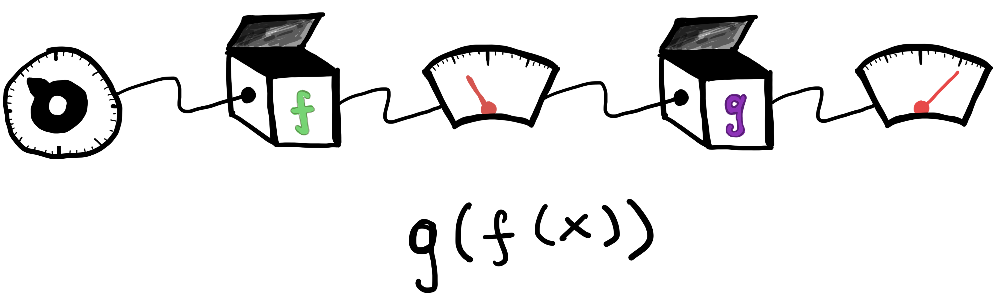

---
format:
  html:
    page-layout: full
---

# 3. The Chain Rule

::: {.panel-tabset .nav-pills}

## Intro

### Composing functions

We have seen how to combine functions by taking sums, products and quotients. One more common method of combining functions is to *compose* them together, i.e. to take the output of one function and feed it in as input to another. For example, in @fig-chain we see that the output of the first function $f$ becomes the input to the second function $g$. My overall transformation is then represented as $g(f(x))$.

  

::: {#fig-chain}
{width="80%"}

A chain of functions
:::

  

What is the derivative of this composite function with respect to $x$? The image in @fig-chain itself suggests the correct answer. If $f$'s output is changing by a factor of two relative to its input, and $g$'s output is changing by a factor of four relative to *it's* input, then the output $g(f(x))$ must be changing by a factor of eight! In other words, the sensitivity of the overall function $g(f(x))$ to its input is a product of the sensitivities of the component functions $f$ and $g$.

#### The Chain Rule

The above argument (carried out with a little more mathematical care) leads us to the **chain rule** for derivatives. The main thing to remember about the chain rule is that the input to my second function is determined by the output of the first--- so in @fig-chain for example, we care about the derivative of $f$ at the input $x$, but the derivative of $g$ at *it's* input which is $f(x)$. Putting this all together, we get that the derivative of the function $g(f(x))$ with respect to $x$ is

$$
g'(f(x))\cdot f'(x).
$$

You may want to think about what this implies if $f$ and $g$ are both decreasing i.e. have negative derivatives. The chain rule tells us that the derivative of the composition must be positive--- can you convince yourself this is correct? What happens to the output $g(f(x))$ if we slightly increase the value of $x$ in this situation? Does it increase or decrease?

#### Chains of arbitrary length

The chain rule is not limited to just two function compositions. The same logic applies if (say) we have a composition $f_3(f_2(f_1(x)))$--- here we have three functions, so we need to take each of their derivatives at their own inputs. Multiplying them together gives the overall derivative
$$
f_3'(f_2(f_1(x))) \cdot f_2'(f_1(x)) \cdot f_1'(x).
$$

You can think of undoing the chain one step at a time, from outside in. First, take the derivative of $f_3$ at its input $f_2(f_1(x))$. But this "input" is itself the output of a function, so we differentiate again to get $f_2'(f_1(x))$. Finally we differentiate the innermost function to get $f_1'(x)$ and then multiply it all together.

As before, the videos linked through the tabs above will provide some more details on how and why the chain rule works, and the exercises will give you some opportunity to practice applying it.

## Video 1

<iframe
    class="video"
    src="https://www.youtube.com/embed/yQrKXo89nHA" 
    title="Chains f(g(x)) and the Chain Rule - Gilbert Strang"
    frameborder="0"
    allow="accelerometer; autoplay; clipboard-write; encrypted-media; gyroscope; picture-in-picture"
    allowfullscreen
></iframe>

## Video 2

<iframe
    class="video"
    src="https://www.youtube.com/embed/wl1myxrtQHQ" 
    title="The Chain Rule, Clearly Explained!!! - Josh Starmer"
    frameborder="0"
    allow="accelerometer; autoplay; clipboard-write; encrypted-media; gyroscope; picture-in-picture"
    allowfullscreen
></iframe>

:::
