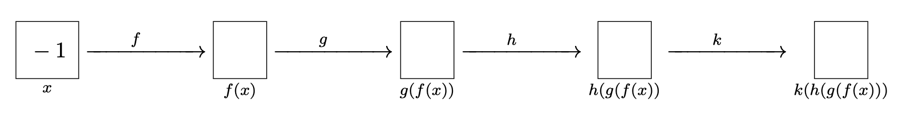
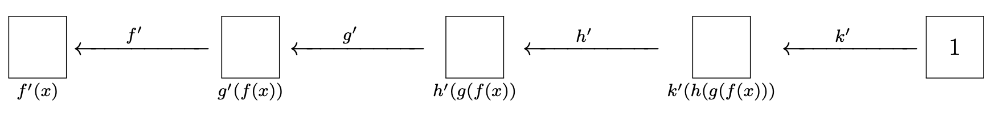

  

# 1.3. Exercises

## Chain Rule

In the following question, we are going to find the derivative of a long chain of functions in two ways. First we will differentiate symbolically, to compute an explicit formula, and then plug in our value of interest. Then, we will emualate automatic differentiation; this is the process by which modern machine learning libraries compute derivatives at a given point.

The function in question is K(x) = (((x2 + 1)2 + 2)2 + 3)2 + 4 and we want to know its derivative at x = -1.

<b>
Phew, that was a lot of work! And the explicit formula in terms of x was quite long, even when we just chained four simple functions together. Thankfully, if we only care about the value of the derivative at a point, there is a better way.
</b>
  

Let f,g,h,k and K be as before and remember f'(x) = g'(x) = h'(x) = k'(x) = 2x.

Did we get the same final answer? What was the most complicated symbolic expression you had to write down for the second approach? Which method would you rather use if you had a chain of 100 functions involving sine, cosine, logarithms and exponents?