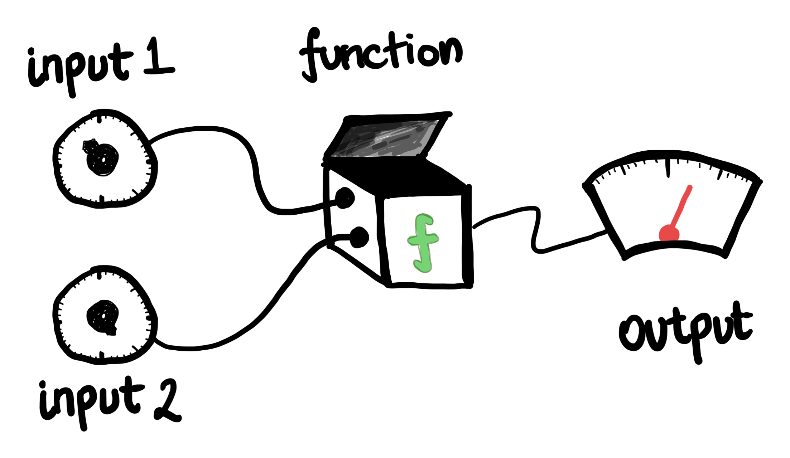
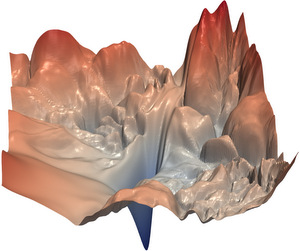

---
format:
  html:
    page-layout: full
---

# 1. Partial Derivatives and Gradients

::: {.panel-tabset .nav-pills}

## Intro

#### A Function with Many Inputs

So far we have discussed functions that accept a single input, and produce a single output. However, one can imagine a black box that accepts more than one input:
  

::: {#fig-func-def}
{width=600}

A function with two inputs and one output.
:::

  

We are accustomed to plotting one-variable functions using 2D plots--- an $x$ axis for input and $y$ axis for output. For a function with two inputs and one output, we now need 3D plots with $x$ and $y$ axes for inputs and (usually) the $z$ axis for the output. If the function is nicely behaved (smooth, continuous, etc) our "graph" will look like a 2D surface sitting in 3D space.

If our function accepts hundreds or thousands of inputs (not uncommon in machine learning) then it is no longer possible to plot a graph of the function! We must use the intuition we build from one- and two-variable examples to try and work out how these more complicated functions might behave.

#### Partial Derivatives and Tangent Planes

Thinking of derivatives as measuring sensitivity, we can see one way to extend the notion to a situation like @fig-func-def. Namely, since there are two input knobs we can simply measure the sensitivity of each. Of course, the sensitivity relative to the top knob may depend on the current value of the bottom one, so we must specify both inputs in order to get a value for the derivative with respect to either input.

In formal mathematical terms, this notion is called the "partial derivative". Say a function $f$ accepts two inputs $x$ and $y$ and produces a real number $f(x,y)$ as output. We define the *partial derivative of* $f$ *with respect to* $x$ *at a point* $(x_0,y_0)$ to be the derivative of the one-variable function $g(x) = f(x,y_0)$ with respect to $x$. This partial derivative is sometimes denoted as $f_x$, and the partial with respect to $y$ as $f_y$.

For one-variable functions, we also saw how the derivative provided us with the slope of the line tangent to the graph of the function at the chosen point. In the two-variable case, our graph looks like a surface, so we instead have a tangent *plane* at each point. The partial derivatives give the slopes in the $x$ and $y$ directions, and from this information we can construct the associated tangent plane. For functions with more than two inputs, we now have tangent hypersurfaces and the situation quickly becomes tricky to visualize. Thankfully, we have the advice of Nobel laureate and Turing award winner Geoff Hinton to help us out:

*"To deal with hyper-planes in a 14-dimensional space, visualize a 3-D space and say 'fourteen' to yourself very loudly. Everyone does it."*

  

::: {#fig-surf}
{width=400}

A function with a more complicated graph ([source](https://github.com/tomgoldstein/loss-landscape/tree/master))
:::

  

#### The Gradient

Suppose at the input $(1,1)$ our function $f$ has output $100$, partial derivative with respect to $x$ equalling $4$, and partial derivative with respect to $y$ equalling $-1$. This means in particular that increasing the value of $x$ while keeping $y$ fixed should increase the value of the output, while increasing the value of $y$ while keeping $x$ fixed should decrease the value of the output. We can write mathematically that

$$
f_x(1,1) = 4 \quad f_y(1,1) = -1.
$$

The *gradient vector* packages these two partial derivatives into a single vector (in the above example, the vector $[4,-1]$). The first entry corresponds to $f_x$ and the second to $f_y$. The gradient vector is denoted $\nabla f$, so in this case we have $\nabla f (1,1) = [4,-1]$.

Now consider the function $\ell(x,y)$ given by
$$
\ell(x,y) = [4,-1] \cdot \begin{bmatrix}x\\y\end{bmatrix} + 97 = 4x - y + 97.
$$
We see it has the same output as $f$ at the input $(1,1)$, namely the output $100$, and it has the same partial derivatives at $(1,1)$ with respect to each input as well. The graph of $\ell$ forms a plane (since $\ell$ is linear)--- in fact, this graph is precisely the tangent plane to the function $f$ at $(1,1)$.

Since $\ell$ is linear, we can quickly determine the direction in which its output increases fastest. The only change in the output of $\ell$ comes from the dot product
$$
[4,-1] \cdot \begin{bmatrix}x\\y\end{bmatrix}.
$$
For a small change $\Delta x$ and $\Delta y$ in inputs, the output of $\ell$ therefore changes by the amount
$$
[4,-1] \cdot \begin{bmatrix}\Delta x\\ \Delta y\end{bmatrix}.
$$

This dot product is maximized precisely with the vector $[\Delta x, \Delta y]$ points in the same direction as the gradient vector $[4,-1]$. Thus the gradient vector $[4,-1]$ gives us the direction in which $\ell$ is most rapidly increasing. Since $\ell$ is the best linear approximation to $f$ near the point $(1,1)$, the same also holds true for $f$--- near the point $(1,1)$, the direction of steepest increase for $f$ is the direction given by the gradient vector $\nabla f(1,1)$.

## Video 1

<iframe
    class="video"
    src="https://www.youtube.com/embed/dK3NEf13nPc" 
    title="Level curves; partial derivatives; tangent plane --- MIT OpenCourseware"
    frameborder="0"
    allow="accelerometer; autoplay; clipboard-write; encrypted-media; gyroscope; picture-in-picture"
    allowfullscreen
></iframe>

## Video 2

<iframe
    class="video"
    src="https://www.youtube.com/embed/2XraaWefBd8" 
    title="Gradient; directional derivative; tangent plane --- MIT OpenCourseWare"
    frameborder="0"
    allow="accelerometer; autoplay; clipboard-write; encrypted-media; gyroscope; picture-in-picture"
    allowfullscreen
></iframe>

:::
