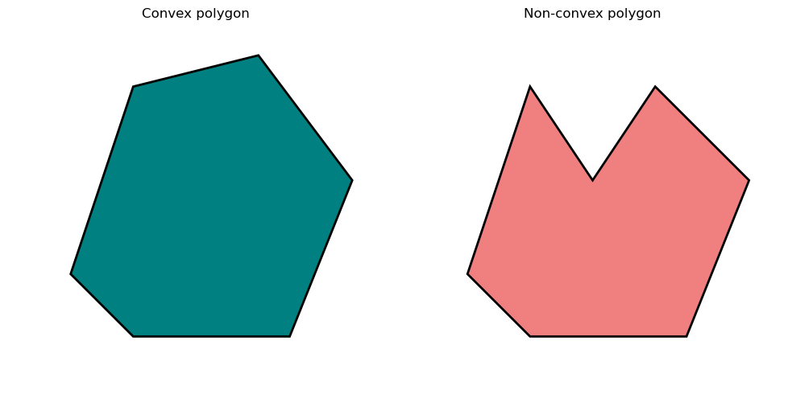

---
format:
  html:
    page-layout: full
---

# 2. Optimization and Convexity

::: {.panel-tabset .nav-pills}

## Intro

#### Gradient Descent

In the previous section, we discussed how the gradient vector to a function shows the direction in which a function increases most rapidly. A natural corollary to this statement is the fact that functions attain local maxima and minima at points where their gradient vectors vanish (similar to how one-variable functions attain maxima and minima where their derivative vanishes). This gives rise to the method of gradient descent for minimizing functions--- you start with an arbitrary guess for a minimum, then walk in the direction of the *negative* gradient. Continue this way, gradually lowering your function value, until the gradient vanishes. At this point you have nowhere left to turn, but since the gradient has vanished you hope you have reached at least a local minimum.

We can apply gradient descent to any differentiable function we want to minimize, and it is generally possible to find local minima this way. The challenge comes in determining whether this local minimum is actually the global minimum of the function.

#### Convexity

We define a convex region as follows: for any two points that lie within the region, the entire line segment connecting these two points must also lie within the region. In @fig-polygs we see an example of a convex region on the left and a non-convex region on the right. The region on the right fails convexity because the line segment joining the top two vertices exits the region itself.

If the area above the graph of a function forms a convex region, that function is called a convex function. So, for example, the function $f(x)=x^2$ is convex, but $f(x) = \sin (x)$ is not. For convex functions all local minima are necessarily global minima, and so if we are able to follow gradient descent to a local minimum, we know we have actually found a global minimum for the function. The study of optimization for convex functions is called (unsurprisingly) convex optimization. It is an old and well-established field of study, and it has numerous applications to real-world problems.

  

::: {#fig-polygs}
{width="50%"}

Convex and non-convex regions.
:::

  

## Video 1

<iframe
    class="video"
    src="https://www.youtube.com/embed/nvXRJIBOREc" 
    title="Minimizing a Function Step by Step --- Gilbert Strang"
    frameborder="0"
    allow="accelerometer; autoplay; clipboard-write; encrypted-media; gyroscope; picture-in-picture"
    allowfullscreen
></iframe>

## Video 2

<iframe
    class="video"
    src="https://www.youtube.com/embed/AeRwohPuUHQ" 
    title="Gradient Descent: Downhill to a Minimum --- Gilbert Strang"
    frameborder="0"
    allow="accelerometer; autoplay; clipboard-write; encrypted-media; gyroscope; picture-in-picture"
    allowfullscreen
></iframe>

## Bonus

The video below introduces the topic of convex optimization, and contains some material you may find interesting. However, most of this material is outside the scope of MDS!

<iframe
    class="video"
    src="https://www.youtube.com/embed/oLowhs83aHk" 
    title="Convex Optimization Basics --- Intelligent Systems Lab"
    frameborder="0"
    allow="accelerometer; autoplay; clipboard-write; encrypted-media; gyroscope; picture-in-picture"
    allowfullscreen
></iframe>

:::
