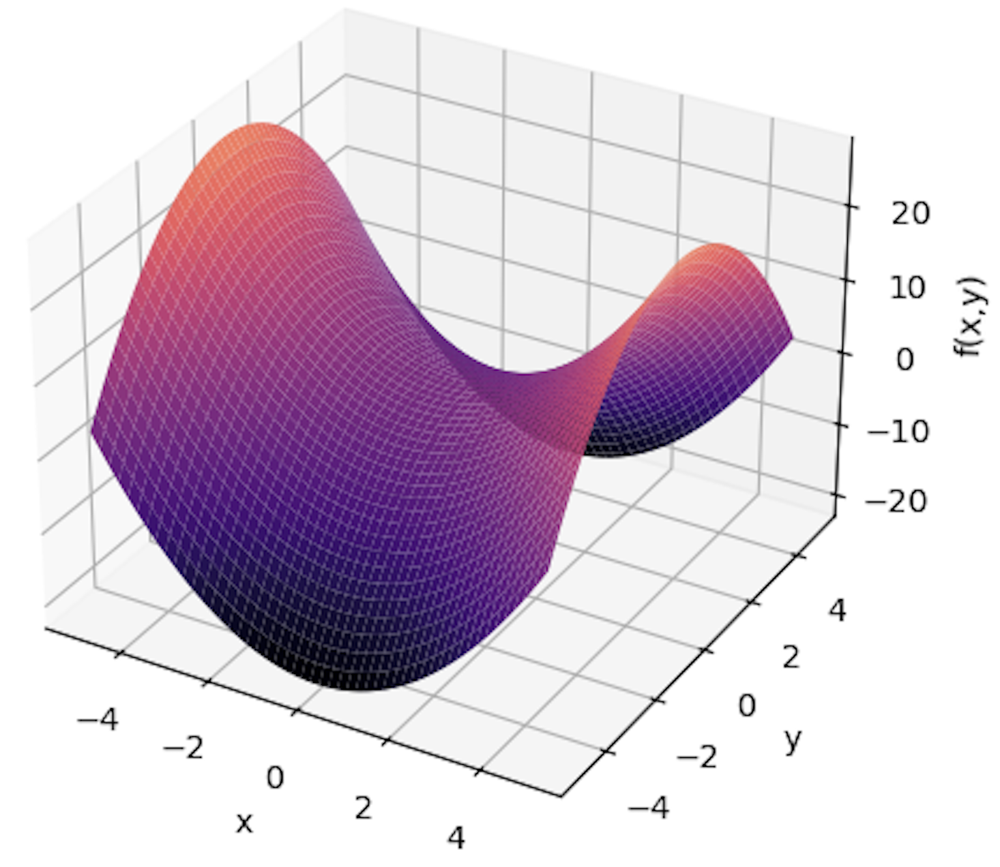
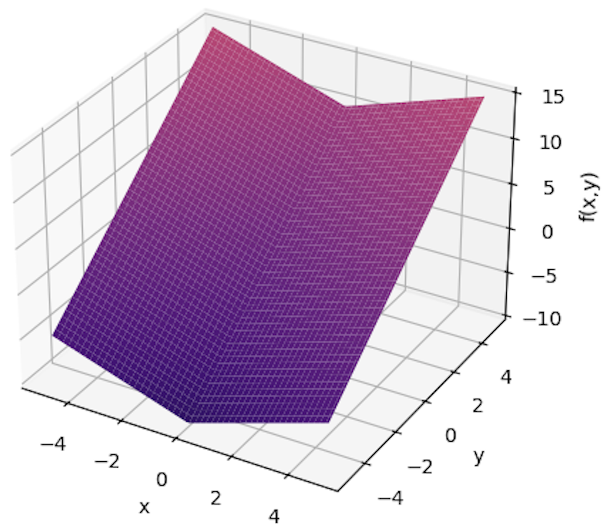
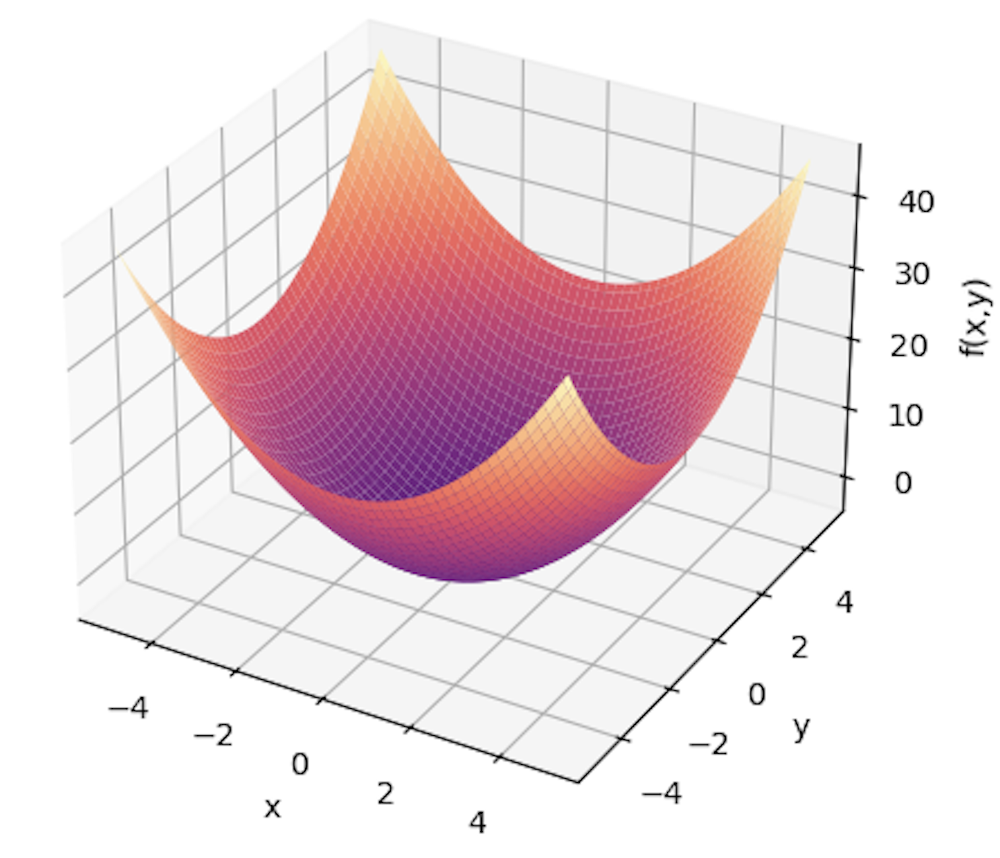
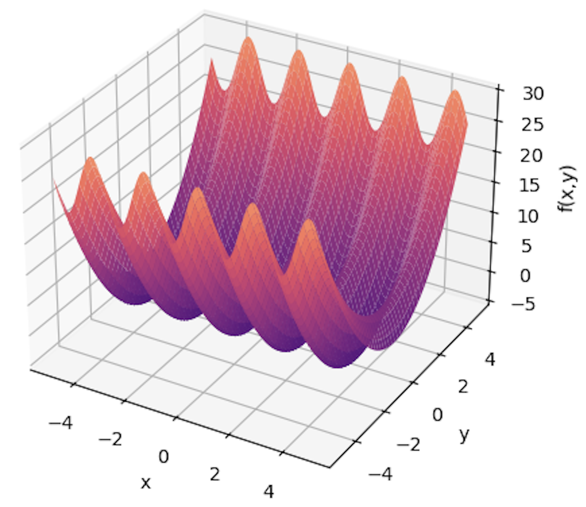
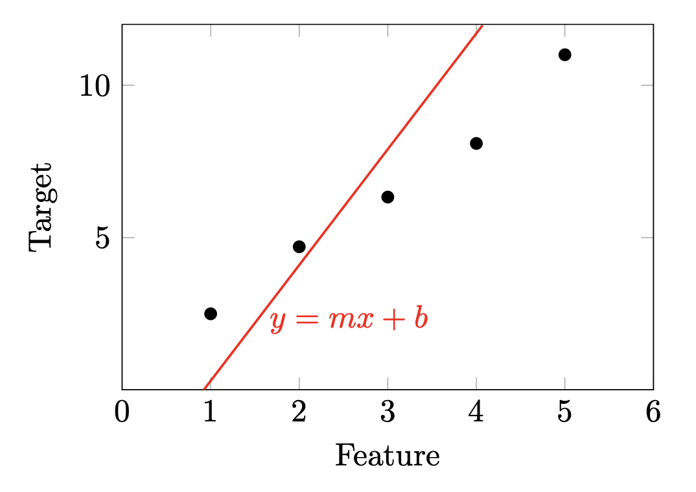

  

# 1.1. Exercises

## Functions of Several Variables

 

 

 

 

**Mean Squared Error as a Multivariate Function**

You are trying to fit a least-squares regression model to the following data :

| Feature | Target |
| ------: | -----: |
|       1 |    2.5 |
|       2 |    4.7 |
|       3 |   6.33 |
|       4 |   8.09 |
|       5 |     11 |

: {tbl-colwidths="[10,20]"}

The data is plotted in the figure below with "Feature" on the $x$-axis and "Target" on the $y$-axis, with an initial 'guess' for a line with slope $m$ and $y$-intercept $b$ in red. The current guess doesn't fit the data too well.

{width=600}

Answer the following:

a) What is the value predicted by the linear regression (red line) when $x=2$? Write your answer in terms of $m$ and $b$.

::: {.callout-note collapse="true"}
## Solution

The predicted value is $2m+b$, since the $y$-value of points on the line is $mx+b$, and here we are interested in $x=2$.

:::

b) What is the \emph{squared} error for the data point $x=4$, i.e. the difference between predicted and actual values? Again, your answer should involve $m$ and $b$.

::: {.callout-note collapse="true"}
## Solution

The data point $x=4$ has a target ($y$) value of $8.09$. So the mean squared error between predicted and actual values for this point is
$$
\big( \; (4m+b)  - (8.09) \; \big)^2
$$

:::

c) Write a complete expression for the \emph{total squared error} between predicted and actual values for the target, i.e. the sum of individual errors for each data point.

::: {.callout-note collapse="true"}
## Solution

Let $\mathcal{X}$ represent our dataset, with individual data points represented as feature-value pairs $(x_0,y_0)$. Then the total squared error is a sum over data points

$$
\sum_{(x_0,y_0)\text{in} \mathcal{X}} \big( \; (mx_0+b) - y_0 \; \big)^2 .
$$

:::

d) How many "inputs" does the total squared error function accept? In other words, the total squared error is a function of how many variables?

::: {.callout-note collapse="true"}
## Solution

The squared error function accepts two inputs, $m$ and $b$. The goal of linear regression is to find the values of $m$ and $b$ at which this function attains its global minimum.

:::

e) Find the gradient vector for the total squared error function (in terms of $m$ and $b$).

::: {.callout-note collapse="true"}
## Solution

If our sum-of-squared-errors function $SSE(m,b)$ is given as described in part c, then its gradient will be

$$
\nabla SSE (m,b) \quad = \quad  \begin{bmatrix} \sum_{(x_0,y_0)\text{in} \mathcal{X}} 2x_0(mx_0 + b - y_0)  \\  \sum_{(x_0,y_0)\text{in} \mathcal{X}} 2(mx_0+b-y_0) \end{bmatrix}. 
$$

:::

f) Find the explicit gradient vector at $m=b=0$.

::: {.callout-note collapse="true"}
## Solution

We can plug in $m=b=0$ into our gradient expression, which gives

$$
\nabla SSE (m,b) \quad = \quad  \begin{bmatrix} \sum_{(x_0,y_0)\text{in} \mathcal{X}} 2x_0(- y_0)  \\  \sum_{(x_0,y_0)\text{in} \mathcal{X}} 2(-y_0) \end{bmatrix}. 
$$

Our table contains the values for $(x_0,y_0)$ that we need to sum over. These give us

$$
\sum_{(x_0,y_0)\text{in} \mathcal{X}} 2x_0(- y_0) = -2 \big(1(2.5)+2(4.7)+3(6.33)+4(8.09)+5(11)\big)= -236.5
$$

and
$$
\sum_{(x_0,y_0)\text{in} \mathcal{X}} 2(- y_0) = -2 \big( 2.5+4.7+6.33+8.09+11 \big) = -65.24.
$$

So our gradient vector at $m=b=0$ is

$$
\nabla SSE (m,b) = \begin{bmatrix} -236.5 \\ -65.24 \end{bmatrix}.
$$

:::

g) Find a linear function of $m$ and $b$ that has the same gradient at $m=b=0$ as your total squared error function above.

::: {.callout-note collapse="true"}
## Solution

The function $f(x,y) = -236.5x - 65.24y$ meets this criterion.

:::

h) **Bonus:** Find the linear function that best approximates your total squared error function near $m=b=1$. 

::: {.callout-note collapse="true"}
## Hint

What would the gradient of this linear function need to be? And what must
be its value at m = b = 1?

:::