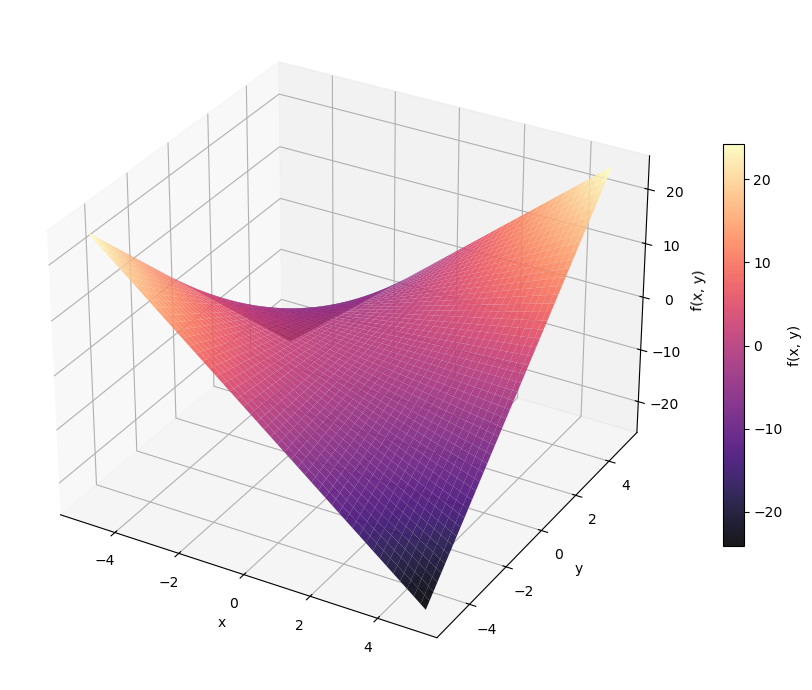

  

# 2.2. Exercises

## Optimization and Convexity

**Functions of two variables with specified minima**

Find a continuous function $f$ of two variables $x,y$ such that:

a) $f$ has a single global minimum

::: {.callout-note collapse="true"}
## Hint

How about trying some of the functions plotted in the Exercise 2.1. section from before? Do any of them work?

:::

b) $f$ has a global minimum at every point with $x=0$

::: {.callout-note collapse="true"}
## Hint

One possibility is to construct a function that only takes non-negative values, and make sure it is always zero when $x=0$.

:::

c) **Bonus:** $f$ has a global minimum at every point along the line $3x-4y = 0$.

::: {.callout-note collapse="true"}
## Hint

In part b we found a function with global minima whenever $x=0$. The condition $x=0$ gives a line in the $xy$ plane. To solve part c, one option is to find a "change of coordinates" such that the line $x=0$ gets mapped to $3x-4y=0$ under this change.

Or if it's easier, carry out the same process as part b from scratch--- find a function that only takes non-negative values, and make sure it is always zero when $3x-4y=0$.

:::

For some possible solutions, click the dropdown below.

::: {.callout-note collapse="true"}
## Solution

There are many possible answers, but a few simple options are:

a) $f(x,y) = x^2 + y^2 - 4$
b) $f(x,y) = x^2$
c) $f(x,y) = (3x-4y)^2$

:::

**Determining convexity for a two-variable function**

In the questions below, we will consider the function $f(x,y) = xy$. First, we look at the behaviour of the function when we fix a value for $y$.

Next, we fix a value for $x$ and see how $f$ behaves as a function of $y$.

::: {.callout-note collapse="true"}
## Hint

The graph of a linear function in one variable looks like a line, and the area above a line is a half-plane. This is a convex region, regardless of the orientation of the line!

:::

Finally, consider the line $x=-y$. Define $k(u) = f(u,-u) = -u^2$. The graph of $k$ is given by the intersection of the graph of $f$ and the plane $x+y=0$.

::: {.callout-note collapse="true"}
## Plotting the graph of f

Here's what the graph of $f$ looks like:
  

{width="30%"}

  

You can see the "saddle" shape clearly here, showing that we have convexity in *some* directions (like the $x$ or $y$ axis directions) but not in others (like the line $x+y=0$). This is the same saddle that we see in the function $x^2-y^2$. In fact, these two functions are equivalent under the change of coordinates
$$
\begin{align*}
x &\mapsto x+y \\ \; y &\mapsto x-y.
\end{align*}
$$

The saddle shape of $f$ is closely connected to why matrix factorization problems (like PCA) have non-convex loss landscapes.
:::
