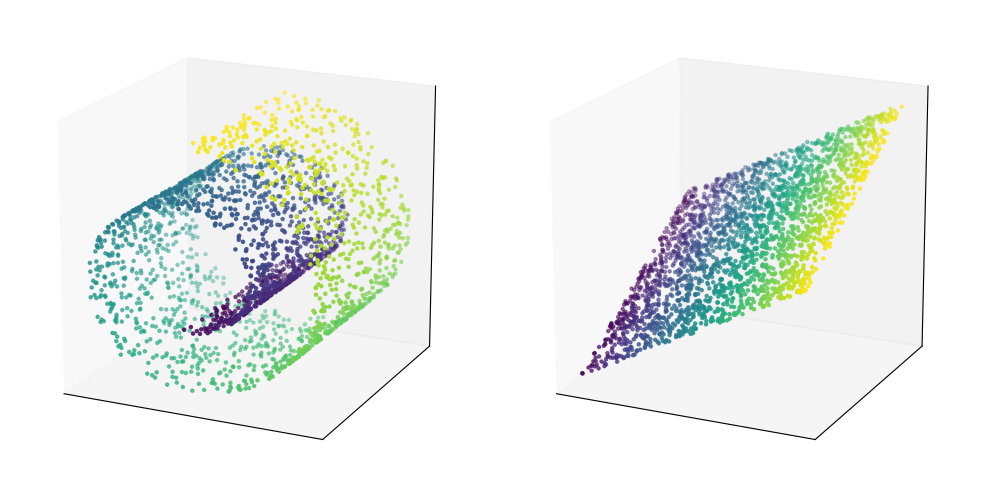

---
format:
  html:
    page-layout: full
---

# 1. Points in High-Dimensional Spaces

::: {.panel-tabset .nav-pills}

## Intro

In the study of *data science*, we often visualize our data as living in some suitably high-dimensional space. As an example, say we have a dataset on housing prices that contains the age, square footage and price of various houses in a given neighbourhood. Each "data point" can then be represented as a list of three numbers: namely the list [age, sq. ft., price]. A 40-year old 1000 sq ft apartment listed for &dollar;500,000 is then represented by the list $[40,1000,500000]$. This can be visualized as a point in 3D space, and every point in this space is a *possible* house in our dataset. Of course some houses (like $[40,1000,500000]$) may be more realistic than others (say $[50000,3,74]$).

Some datasets are easy to represent by lists of numbers (e.g. images can be represented as lists of pixel values). Others are harder to represent this way--- for example, how would you represent all e-books available at the UBC library via a list of numbers?

#### What is a Vector?

Vectors are lists of numbers too, but with the added ability that we can scale a vector up or down by a constant factor: $$2\times[40,1000,500000] = [80,2000,1000000]$$ and we can add vectors together $$[1,1,1] + [2,0,0] = [3,1,1]$$: by adding their elements component-wise.

It may not seem very sensible to "add" houses together, but notice even in this very limited example we can find a use for this notion. Namely, we can say two houses in our dataset are "similar" to each other if their *difference* as vectors is small in size.

#### What is a Vector Space?

In our previous example, our vectors are ordered lists of real numbers of length 3. The set of all possible length-3 lists of real numbers forms the *vector space* known as $\mathbb{R}^3$. This space is closed under scaling and addition of vectors, meaning if I combine two vectors from this space together (or stretch/shrink either one) I still end up with a result withing the same space.

An important property of this space is its *dimension*, which in this case equals 3, because we have three independently varying components within this space.

#### What is a Subspace?

Let us move away from the specific example of housing data, and consider the "abstract" space $\mathbb{R}^3$. You might notice that the set of all vectors whose third component is zero also forms a space that is closed under scaling and vector addition. So is the set of vectors whose first component equals the third, or the set of all vectors such that the sum of its components equals zero.

These are all examples of two-dimensional subpsaces of $\mathbb{R}^3$. They only have two independently varying components--- in all cases after I specify the first and second component, I automatically know the value of the third. In high-dimensional spaces, it may not be immediately obvious when a set of vectors fills out the entire space in question, or merely a lower-dimensional subspace.

#### Why do we call it "Linear" Algebra?

Consider the plots below.

In both cases, we have a set of points lying along a 2D surface sitting inside 3D space. On the left, we have a surface shaped like a "swiss roll", curling in on itself. On the right, we have a flat plane.

Linear algebra studies flat surfaces like the one on the right, and transformations that stretch, squeeze or rotate this space while keeping it flat. It turns out we can get quite far in data science and machine learning dealing only with linear algebra.

The swiss roll cannot be easily approximated by flat surfaces, but even here it helps to understand linear algebra well. Later on during the MDS program, you will learn techniques that take simple linear building blocks and [piece them together](https://math.mit.edu/%7Egs/learningfromdata/siam.pdf) to model non-linear data. They can be used to flatten out the swiss-roll, and allow us to use all our favourite linear models to study it.

## Video 1

<iframe
    class="video"
    src="https://www.youtube.com/embed/fNk_zzaMoSs" 
    title="Vectors --- 3Blue1Brown"
    frameborder="0"
    allow="accelerometer; autoplay; clipboard-write; encrypted-media; gyroscope; picture-in-picture"
    allowfullscreen
></iframe>

## Video 2

<iframe
    class="video"
    src="https://www.youtube.com/embed/k7RM-ot2NWY" 
    title="Linear combinations, span and basis --- 3Blue1Brown"
    frameborder="0"
    allow="accelerometer; autoplay; clipboard-write; encrypted-media; gyroscope; picture-in-picture"
    allowfullscreen
></iframe>

## Video 3

<iframe
    class="video"
    src="https://www.youtube.com/embed/QQpvGlF_1Qo" 
    title="Subspaces of Three Dimensional Space"
    frameborder="0"
    allow="accelerometer; autoplay; clipboard-write; encrypted-media; gyroscope; picture-in-picture"
    allowfullscreen
></iframe>

:::
