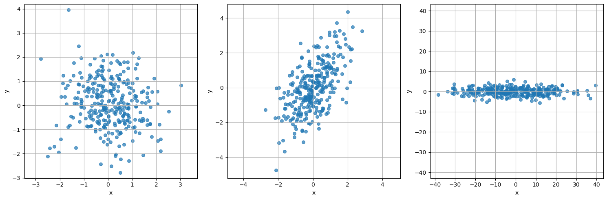
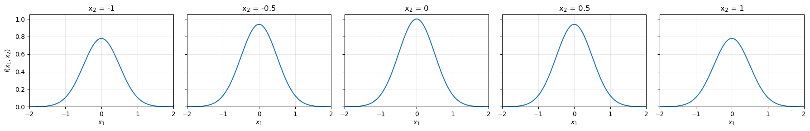
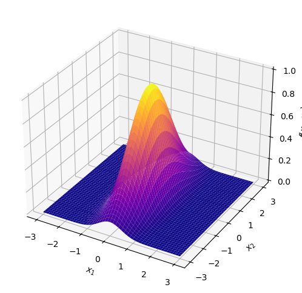
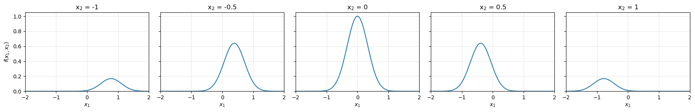
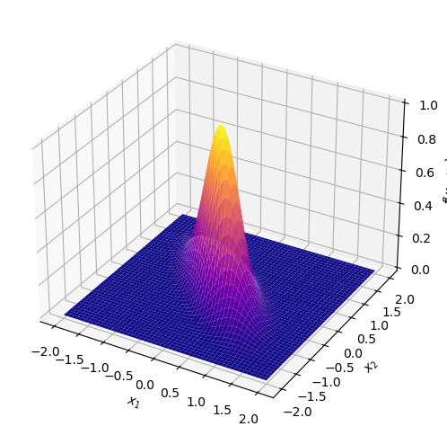
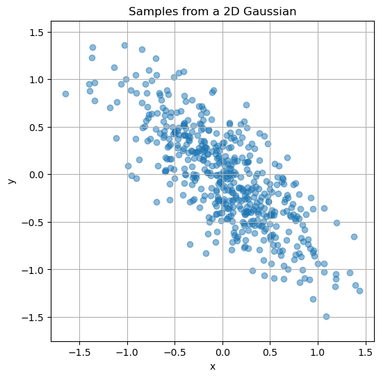

  

# 3.3. A Bonus Question

In the question below, we will use our knowledge of matrices to build a 2-dimensional analogue of the familiar 'bell curve'. Part I of the question only requires basic knowledge of matrix-vector multiplication. For completing part Part II, it helps to have familiarity with the notion of eigenvalues and eigenvectors. This is a challenging exercise.

  

::: {#fig-exs}
{width="70%"}

Some examples of synthetic data sampled from multivariate Gaussians of different shapes and orientations.
:::

  

## Part I

Let $A$ be the matrix given by
$$
A = \begin{bmatrix}
    4 & 0 \\
    0 & \tfrac12
\end{bmatrix}.
$$

For a 2D vector $\bar{\mathbf x} = [x_1, x_2]^T$, define
$$
f(\bar{\mathbf x}) \; = \quad e^{-\frac12 \bar{\mathbf x}^T A \bar{\mathbf x}}.
$$

Answer the following questions.

a) Set $x_2 = 0$ and draw a graph of the resulting (univariate) function with repsect to $x_1$.
b) Draw a similar graph with respect to $x_2$ after setting $x_1 = 0$.
c) Is $f([x_1, 0]^T)$ bigger or smaller than $f([x_1, 10]^T)$? Where does the function $f$ attain its maximum value?

::: {.callout-note collapse="true"}
## Solution

We can write $f$ as a function of $x_1$ and $x_2$ by carrying out the matrix multiplication in the exponent:
$$
f([x_1,x_2]^T) = e^{-(4x_1^2 + \frac12 x_2^2)}.
$$

Note the absence of any "cross" term, i.e. any term of the form $x_1x_2$. This results from $A$ being a diagonal matrix.

For any fixed value of $x_2$, we get a function of $x_1$ that looks like a usual one-variable bell-curve centered at zero. The height of the bell depends on the choice of $x_2$, with the tallest curve being the one for $x_2=0$. The same picture emerges fixing a value for $x_1$ and graphing the function with respect to $x_2$, except the exponentials are more "spread out" i.e. less concentrated around the origin.

$f$ attains its maximum value at the origin, when $x_1=x_2=0$.
:::

d) For each choice of $x_2 = -1, -0.5, 0, 0.5, 1$, simplify $f$ into a function of the single variable $x_1$. Then, plot each of the resulting functions using your favourite graphing software. What do you notice about the graphs?
e) Draw a graph of the overall function $f$ as a function of 2 variables.

::: {.callout-note collapse="true"}
## Solution

As we step through each of the values for $x_2$, we see a sequence of bell-shaped curves rising in height until $x_2=0$, then dropping back down. All the curves are centered at zero.

  

::: {#fig-A}
{width="80%"}

A sequence of slices.
:::

  

The graph of $f$ looks like a "hill" with a peak at the origin, and smooth exponential decay in all directions. The decay is faster in the $x_1$ direction (corresponding to the larger value $4$ in $A$) than in the $x_2$ direction (which corresponds to the smaller value $1/2$). In other words, the hill is narrow in the $x_1$ direction and wide in the $x_2$ direction.

  

::: {#fig-A}
{width="40%"}

The graph of $f$.
:::

  

:::

## Part II

Now set 
$$
B \; = \;
\begin{bmatrix}
    9 & 7 \\
    7 & 9
\end{bmatrix} \qquad \text{and}
$$

and define

$$
g(\bar{\mathbf x}) \; = \quad e^{   - \frac12 \bar{\mathbf x}^T B \bar{\mathbf x}   }.
$$

a) For each vector $v \in \{[0,1],[1,0],[1,1],[1,-1]\}$, calculate the value of the product $Bv$.
b) How does the matrix $B$ transform 2-dimensional space when multiplying on the left? In other words, which linear transformation does left-multiplication by $B$ give rise to?

::: {.callout-note collapse="true"}
## Solution

In Part I, we dealt with the diagonal matrix $A$. Diagonal matrices stretch the space along the coordinate axes. By contrast, $B$ is non-diagonal. However, its eigenvectors $[1,1]$ and $[1,-1]$ (with eigenvalues $16$ and $2$ respectively) are still orthogonal to each other. They are just rotated from the coordinate axes by 45 degrees!

So $B$ stretches the plane by a factor of $16$ in the $x_1=x_2$ direction, and by a factor of $2$ in the $x_1 = -x_2$ direction.

:::

c) For each choice of $x_2 = -1, -0.5, 0, 0.5, 1$, simplify $g$ into a function of the single variable $x_1$. Then, plot each of the resulting functions using your favourite graphing software. What do you notice about the resulting graphs? Is the sequence similar to what we saw in Part I, or are there any differences?

::: {.callout-note collapse="true"}
## Solution

We can write $g$ as
$$
g([x_1,x_2]^T) = e^{-\frac12(9x_1^2 + 14x_1x_2 + 9x_2^2)}.
$$

Notice we now have the term $14x_1x_2$ in the middle. This "non-diagonal" term means that as we take slices for fixed $x_2$ (i.e. set $x_2 = -1, 0.5, 0 \ldots$ and so on) the peak of the resulting curve in $x_1$ shifts from right to left. So the graph of $g$ as a 2D function is not aligned with the coordinate axes in the nice way that we saw in Part I.

  

::: {#fig-A}
{width="80%"}

A sequence of slices.
:::

  

:::

d) Now, set $u = x_1+x_2$ and draw the same sequence of plots for $u = -1, -0.5, 0, 0.5, 1$. What do you notice this time?
e) What does the graph of $g(\bar x)$ look like? Is it similar to or different from the graph of $f$?

::: {.callout-note collapse="true"}
## Solution

The graph of $g$ is aligned along the direction given by the *eigenvectors of* $B$. It is narrow in the $[1,1]$ direction (corresponding to the larger eigenvalue $16$) and wider in the $[1,-1]$ direction (corresponding to the smaller eigenvalue $2$). The behaviour is quite similar to the function $f$, we just need to "rotate" our point of view a little into a new coordinate basis given by the eigenvectors of $B$.

  

::: {#fig-A}
{width="40%"}

The graph of $g$.
:::

  

:::

*The functions you graphed for this exercise are closely related to multivariate Gaussians, which are like normal distributions in higher-dimensional space. The matrices* $A$ *and* $B$ *control the shape and orientation of the 'bell'.*

  

::: {#fig-gm}
{width="50%"}

Points randomly sampled from a two-variable Gaussian with mean $[0,0]$ and covariance matrix given by $B^{-1}$.
:::

  

