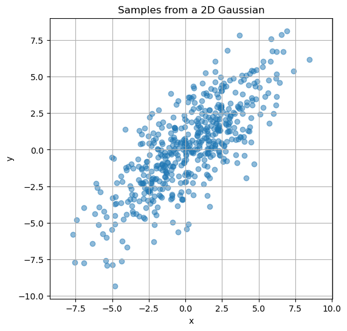

  

# 3.3. A Bonus Question

In the question below, we will use our knowledge of matrices to build a 2-dimensional analogue of the familiar 'bell curve'. Part I of the question only requires basic knowledge of matrix-vector multiplication. For completing part Part II, it helps to have familiarity with the notion of eigenvalues and eigenvectors. This is a challenging exercise.

## Part I

Let $A$ be the matrix given by
$$
A = \begin{bmatrix}
    4 & 0 \\
    0 & \tfrac12
\end{bmatrix}.
$$

For a 2D vector $\bar{\mathbf x} = [x_1, x_2]^T$, define
$$
f(\bar{\mathbf x}) \; = \quad e^{-\frac12 \bar{\mathbf x}^T A \bar{\mathbf x}}.
$$

Answer the following questions.

a) Set $x_2 = 0$ and draw a graph of the resulting (univariate) function with repsect to $x_1$.
b) Draw a similar graph with respect to $x_2$ after setting $x_1 = 0$.
c) Is $f([x_1, 0]^T)$ bigger or smaller than $f([x_1, 10]^T)$? Where does the function $f$ attain its maximum value?
d) For each choice of $x_2 = -1, -0.5, 0, 0.5, 1$, simplify $f$ into a function of the single variable $x_1$. Then, plot each of the resulting functions using your favourite graphing software. What do you notice about the graphs?
e) Draw a graph of the overall function $f$ as a function of 2 variables.

## Part II

Now set 
$$
B \; = \;
\begin{bmatrix}
    9 & 7 \\
    7 & 9
\end{bmatrix} \qquad \text{and}
$$

and define

$$
g(\bar{\mathbf x}) \; = \quad e^{   - \frac12 \bar{\mathbf x}^T B \bar{\mathbf x}   }.
$$

a) For each vector $v \in \{[0,1],[1,0],[1,1],[1,-1]\}$, calculate the value of the product $Bv$.
b) How does the matrix $B$ transform 2-dimensional space when multiplying on the left? In other words, which linear transformation does left-multiplication by $B$ give rise to?
c) For each choice of $x_2 = -1, -0.5, 0, 0.5, 1$, simplify $g$ into a function of the single variable $x_1$. Then, plot each of the resulting functions using your favourite graphing software. What do you notice about the resulting graphs? Is the sequence similar to what we saw in Part I, or are there any differences?
d) Now, set $u = x_1+x_2$ and draw the same sequence of plots for $u = -1, -0.5, 0, 0.5, 1$. What do you notice this time?
e) What does the graph of $g(\bar x)$ look like? Is it similar to or different from the graph of $f$?

*The functions you graphed for this exercise are closely related to multivariate Gaussians, which are like normal distributions in higher-dimensional space. The matrices* $A$ *and* $B$ *control the shape and orientation of the `bell', and the vector* $\mu$ *controls its location.*

  

::: {#fig-gm}
{width="50%"}

Points randomly sampled from a two-variable Gaussian with mean $[0,0]$ and covariance matrix given by $B^{-1}$.
:::

  

